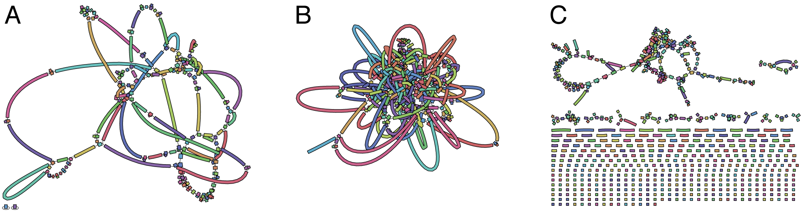

**A** is an very good Illumina read graph – the contigs are long and there are no dead ends. This read set is ideally suited for use in Unicycler and shouldn't require too many long reads to complete (10–15x would probably be enough).

**B** is also a good graph. The genome is more complex, resulting in a more 
tangled structure, but there are still very few dead ends (you can see one in the lower left). This read set would also work well in Unicycler, though more long reads may be required to get a complete genome (maybe 20x or so).

**C** is a disaster! It is broken into many pieces, probably because parts of the genome got no read depth at all. This genome may take lots of long reads to complete in Unicycler, possibly 30x or more. The final assembly will probably have more small errors (SNPs and indels), as parts of the genome cannot be polished well with Illumina reads.

## ref
http://rrwick.github.io/Bandage/
https://github.com/rrwick/Unicycler